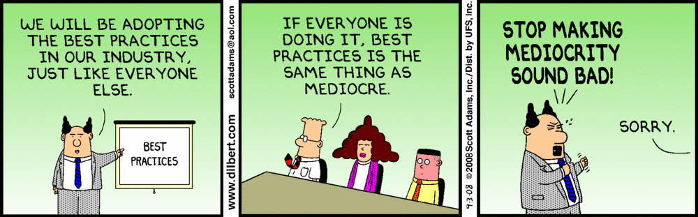

chef-patterns
=============

### [Cookbook Patterns](./wiki/cookbook_patterns)

### [Server Patterns](../../wiki/server_patterns)

### [Implementation Patterns](./wiki/implementation_patterns)

### [Cultural Patterns](./wiki/cultural_patterns)

Introduction
------------

Welcome to the _Library of Chef Patterns and Practices_ (aka 'LOPP': Library of Patterns and Practices).  

About "Patterns" and "Best Practices":
- Design _patterns_ are solutions to software design problems you find again and
  again in real-world application development. Patterns are about reusable
  designs and interactions. You will not use and often cannot use
  every pattern, and many of them are mutually exclusive. The inspiration comes
  from TK 'Design Pattterns' and Christopher Alexander's 'Pattern Language'.
- _Anti-patterns_ are commonly adopted practices that end up being counter-productive. They often have their root in good _design patterns_ but are often taken to an extreme or miss a key element that subvert their good intent.
- _Best Practices_ are often conflated with mediocritiy, thanks in part
  to the work of Scott Adams. We have nonetheless identified Chef best practices that all sites should adopt unless there are uniquely compelling circumstances.

The term 'pattern' herein is used for any single topic describing a single pattern, antipattern or best practice.

Organization
------------

This repo is an interim home to the LOPP, pending transition to a yet-to-be-determined [LOPP platform](./LOPP_platform.md). For the time being:

- all patterns are described in file in the top level directory
- the patterns are organized around general topics as follows:
  - _language_ patterns: apply to using the Chef and Ruby language within a cookbook (lump in with cookbook?)
  - [_cookbook_ patterns](./wiki/cookbook_patterns): apply to using cookbooks together as units describing and application or infrastructure. This includes using _roles_, _environments_, _policyfiles_, etc. since those are all about getting cookbooks to work together rationally in the context of converging a node to do usefule work.
  - [_server_ patterns](./wiki/server_patterns): apply to running your Chef server, or Hosted Chef, or doing without a server entirely
  - _operating_ patterns: apply to using Chef servers and clients together, including _orchestration_ (lump in with implementation?)
  - [_implementation_ patterns](./wiki/implementation_patterns): apply to using these technologies together in ways that aren't captured by above topics.
  - [_cultural_ patterns](./wiki/cultural_patterns): apply to technology-independent patterns of success.
- each pattern should be named as `topic_(bp|ap|pat)-short-description.md` to enable rational sorting, where bp='bestpractice', ap='anitpattern', pat='pattern'. Examples:
  - 'language_pat-use-common-idioms.md'
  - 'cultural_pat-demonstrate-relentlessly.md'
  - 'server_ap-scaling-early.md'
  - 'implementation_bp-version-contral-all-the-things.md'
- pattern template: See [pattern template](0_pattern-template.md)

### Adding new patterns

**Candidate patterns** should be added to the relevant wiki pages. As of this time, all patterns are candidate patterns.

When we formally adopt patterns through a yet-to-be-determined process,
new patterns should be submitted as PRs following standard Github workflow, using the template and the naming conventions described above. Updating this index file will be the responsibility of the maintainers.

Feel free to submit issues that describe candidate patterns prior to the full pattern, but please do so with the intent of writing the pattern if subsequent discussion is encouraging.

Reference material
------------------

- [Pattern Template](./0_pattern-template.md)
- [LOPP Platform](./LOPP_platform.md): What the final home for LOPP should be.
- [Original README](./old_README.md): A dumping ground that was the genesis for the LOPP.

Administrivia
-------------

## Copyright

Chef Patterns are in the public domain. In jurisdictions that do not allow for this, they are available under CC0. To the extent possible under law, the person who associated CC0 with their work has waived all copyright and related or neighboring rights to their work.

## Maintainers

Peter Burkholder (pburkholder) 
Josh O'brien 
Mike Tyler ``
etc....
